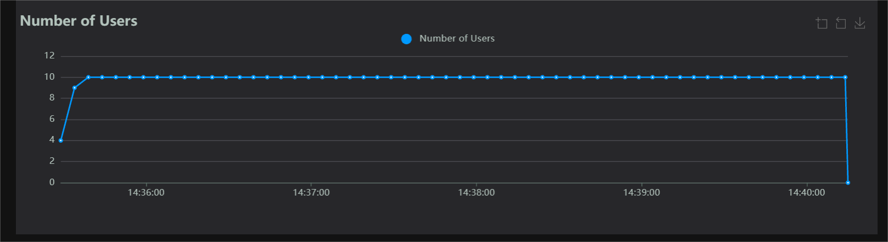
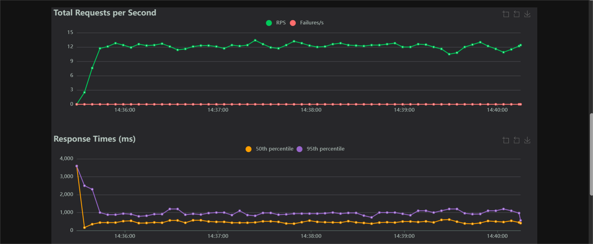
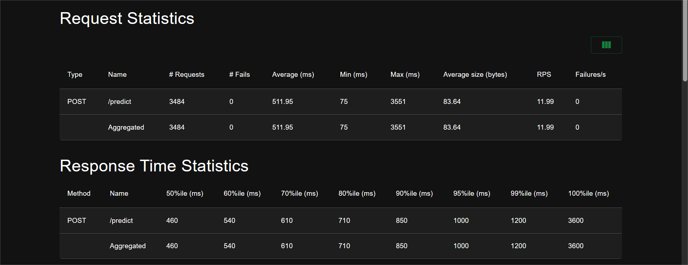
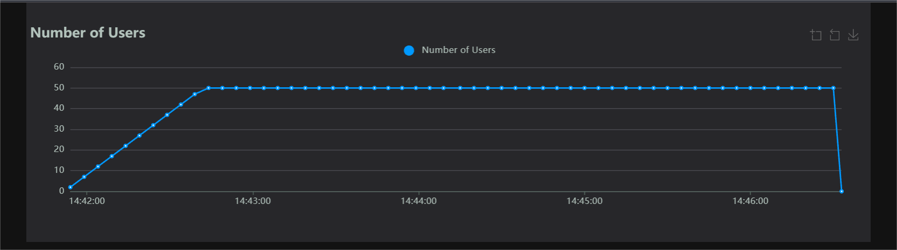
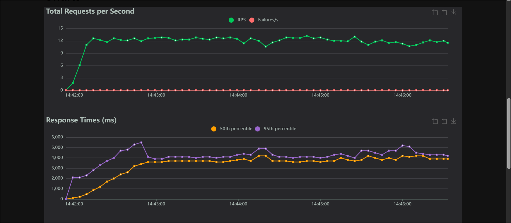
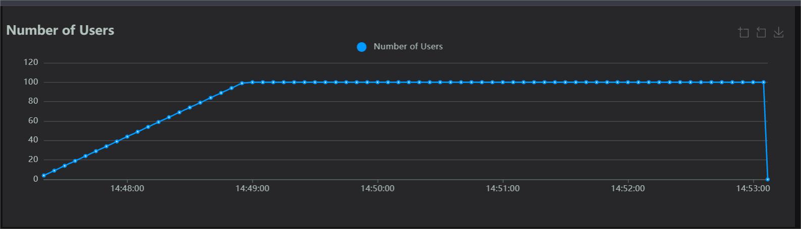
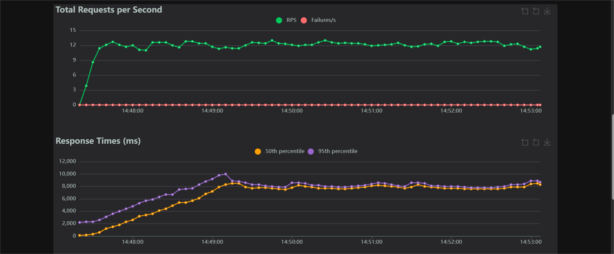
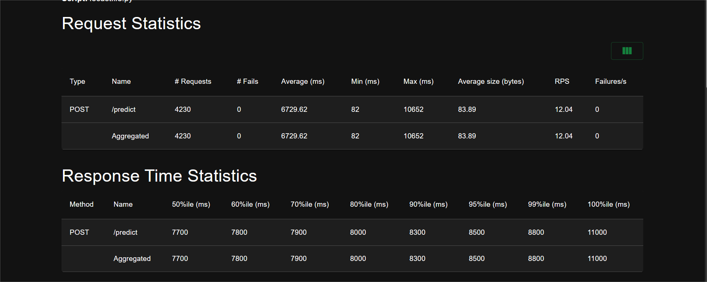

# the-sentimentalyzer-service
A blueprint for serving heavy Machine Learning models (like Transformer) via an HTTP API.

## Overview
The Sentimentalyzer is a blueprint for serving heavy Machine Learning models (like Transformers) via an HTTP API.
Unlike standard web applications which are **IO bound** (waiting for databases), Ml services are **Compute bound** (matrix multiplication). This project explores why standard backend patterns fails when servving AI, and implements the **Dynamic Batching** architecture used by production systems like Nvidia Triton, Ray Serve, and vLLM.
The goal of this project is to transform a fragile, high-latency prototype into a robust, high-throughput inference engine.

## The Experiment
This repository will contain two distinct implementations to demonstrate for the "Infa Gap":

- The Naive Implementation (Baseline)
The naive implementation uses a standard FastAPI route that calls the model directly on each incoming request. Requests are handled sequentially, meaning each inference is processed one at a time. As a result, the GPU or CPU often sits idle between requests, throughput quickly reaches a ceiling and latency grows dramatically as concurrency increases.


- The High-Performance Implementation (Goal)
The high-performance implementation is built around a producer-consumer architecture, where the producer asynchronously accepts incoming HTTP request and enqueues them, while a consumer continuously pulls multiple pending requests from the queue, batches them together into a single tensor, and executes on effecient inference pass, resulting in a significantly higher throughput, stable and predictable latency under load, and near-maximum utilization of the underlying hardware.

## Tech Stack
- Language: Python 3.9+
- API Framework: FastAPI + Uvicorn (ASGI server)
- ML Framework: Pytorch & HuggingFace Transformers
- Model: distilbert-base-uncased-finetuned-sst-2-english (Sentiment Analysis)
- Benchmarking: Locust.io

## Getting Started
1. CLone the repo 

    ```
    git clone git@github.com:olumidedaramola21/the-sentimentalyzer-service.git
    cd sentimentalyzer
    ```

2. Set up Virtual Environment

- Windows (Bash / Poweshell)
    ```bash
    python -m venv venv
    source venv/Scripts/activate
    ```

- Mac/Linux
    ```bash
    python3 -m venv venv
    source venv/bin/activate
    ```

3.  Install Dependencies
    ```
    pip install -r requirements.txt
    ```

Running the Experiment (Naive Experiment)
This experiment demonstrates how a naive ML inference sever breaks down under load.
1. Start the Naive Server (Baseline)
    ```
    uvicorn naive_server:app --reload
    ```
    wait for the logs to show: ```INFO:naive_server:Model loaded!```
2. Start the load generator
    ```
    locust -f locustfile.py
    ```

3. Run the Load Test

    1. open your browser and go to:  http://localhost:8089
    2. configure the test:

        Number of users: 10

        Spawn rate: 1

        Host: http://localhost:8000

    3. click Start 

  
## Performance Benchmarks: The "Inference Gap"
To demonstrate why standard web architectures fail for AI workloads, I stress-tested the **Naive Implementation** using Locust. The results show a clear progression from functional, to saturated, to completely broken.

### 1. Baseline (10 Concurrent Users)
At a low load, the system remains functional but is already showing signs request blocking and inefficient hardware utilization.
    - **RPS:** ~12 req/s
    - **Median Latency (p50):** ~460 ms
    - **Max Latency:** ~3600 ms
    - **Status:** Functional, but significantly slower than a typical IO-bound web service.






### 2. Saturation (50 Concurrent Users)
At 50 concurrent users, the system reaches its **throughput ceiling**. The CPU is fully saturated executing inference sequentially, and additional concurrency no longer translates into higer throughput.
    - **RPS:** ~12 req/s (plateaued)
    - **Median Latency (p50):** ~3700 ms
    - **Max Latency:** ~6200 ms
    - **Status:** Saturated. Request begins to queue aggressively, resulting in noticeable and increasing user-facing latency.





### 3. Latency Collapse (100 Concurrent Users)
At 100 concurrent users, the system  remains throughput-bound but experiences a severe **latency collapse**. The server continues processing at its maximum sustainable rate, but excessive queueing causes the reponse time to grow dramatically.
    - **RPS:** ~12 req/s (unchanged, throughput-bound)
    - **Median Latency (p50):** ~7,700 ms (7.7 s)
    - **Max Latency:** ~11,000 ms (11 s)
    - **Status:** Functionally alive, but practically unusable due to extreme tail latency.





*Screenshots are provided in ```benchmarks/baseline_screenshots/``` for reference*
*For detailed results and metrics, see the full HTML report in ```benchmarks/report```*

## Naive Implementation Bottleneck
- Sequential Processing: Each HTTP request triggers a full model inference handled one at a time.
- GPU Underutilization: Even though PyTorch releases the GIL during GPU computation, requests are dispatched individually without batching, leaving GPU compute cycles idle between inferences.
- Throughput Bound: The server's maximum request-per-second (RPS) is capped by per-request GPU processing time, independent of incoming concurrency.
- Latency Explosion: Additional concurrent request queue up in Python's request handlers, causing tail latency to increase dramatically while throughput remains flat.
    

## Contributing
Feel free to open issues if you find optimizations or want to discuss.
